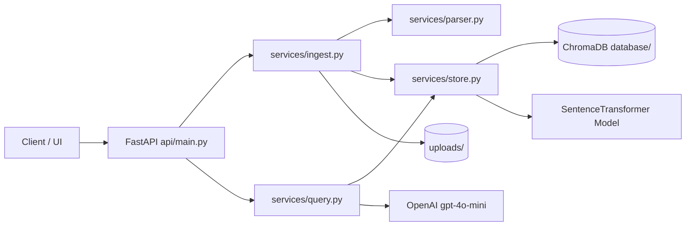

# FinanceAI Project Architecture Overview

## 1. High-Level Overview

- Problem solved: This project lets a user upload bank/card statement PDFs, converts statement rows into searchable vectors, and answers natural-language finance questions.
- Architecture style: Layered modular monolith with a Retrieval-Augmented Generation (RAG) pipeline.
- Key technologies: FastAPI, pdfplumber, sentence-transformers, ChromaDB, OpenAI GPT-4o-mini.

## 2. Project Folder Structure

- `api/`: HTTP API endpoints (`api/main.py`).
- `services/`: Business logic.
  - `parser.py`: PDF table parsing and cleanup.
  - `ingest.py`: Ingestion orchestration and duplicate checks.
  - `query.py`: Semantic retrieval and LLM answering.
  - `store.py`: Lazy access to embedding model and Chroma collection.
- `core/`: Shared config/constants (`core/config.py`).
- `database/`: Local Chroma persistence.
- `uploads/`: Uploaded PDF files.
- `tests/`: API/service tests.
- `main.py`: Compatibility app entrypoint.

Folder interaction:
- API layer calls service functions.
- Services use core config and storage helpers.
- Storage helpers talk to Chroma and embedding model.

## 3. Application Flow

### Upload Flow (`POST /upload`)
1. Validate file name, type, and size.
2. Save file to `uploads/`.
3. Parse transactions from PDF.
4. Check duplicate document by metadata source.
5. Generate embeddings.
6. Store documents + vectors + metadata in Chroma.
7. Return ingestion result.

### Chat Flow (`POST /chat`)
1. Validate question payload.
2. Embed question and run semantic search in Chroma.
3. Build prompt with retrieved chunks.
4. Call OpenAI model.
5. Return answer.

### Transactions Flow (`GET /transactions`)
1. Validate `limit`.
2. Read records from Chroma.
3. Return count and transaction list.

## 4. Core Components

- FastAPI app: Transport layer, validation, and response shaping.
- Parser service: Converts PDF tables into stable row strings.
- Ingest service: End-to-end ingestion coordinator.
- Query service: Retrieval + prompt + generation.
- Store service: Lazy initialization of shared infra clients.
- Config module: Centralized runtime settings.

## 5. Design Patterns

- Service Layer: Keeps business logic outside endpoints.
- Lazy Singleton: Defers heavy client/model creation until first use.
- Factory-like Accessors: Controlled creation via `get_collection()`, `get_embedding_model()`, `get_openai_client()`.
- Error Translation: Wraps low-level exceptions into domain errors (`IngestionError`, `QueryError`).

## 6. Data Layer

- Storage type: Vector database (Chroma), no ORM models.
- Stored fields:
  - `id`: `{doc_id}_{index}`
  - `document`: cleaned transaction row
  - `embedding`: sentence-transformer vector
  - `metadata`: `source`, `chunk_index`, `total_chunks`
- Retrieval:
  - Semantic: `collection.query(...)`
  - List records: `collection.get(limit=...)`

## 7. API Endpoints / Features

- `POST /upload`
  - Input: multipart PDF
  - Output: ingestion status, filename, transactions added, reason
  - Logic: validate, save, ingest, duplicate skip

- `POST /chat`
  - Input: `{ "question": "..." }`
  - Output: answer + normalized question
  - Logic: semantic retrieval + LLM generation

- `GET /transactions?limit=...`
  - Input: integer `limit` in range 1..1000
  - Output: transaction list and count
  - Logic: fetch from Chroma

## 8. External Dependencies

- `fastapi`, `uvicorn`: HTTP API + server
- `python-multipart`: file upload support
- `pdfplumber`: table extraction from PDFs
- `sentence-transformers`: embedding generation
- `chromadb`: persistent vector store
- `openai`: answer generation model client

## 9. Security and Performance

- Current state:
  - No authentication.
  - Basic validation present for file type/size and payload fields.
  - CORS is open (`*`) and should be restricted in production.
- Performance notes:
  - Lazy client/model init is good.
  - Upload currently reads file fully into memory.
  - Ingestion could be moved to background jobs for larger files.

## 10. Improvement Suggestions

- Code quality:
  - Remove unused dependencies.
  - Expand typing and structured logging.
- Architecture:
  - Add interfaces for vector store and LLM clients.
  - Add dependency injection boundaries.
- Production readiness:
  - Add auth + rate limiting.
  - Restrict CORS.
  - Add health checks, metrics, and startup validation.
  - Add CI checks (lint/format/type/test).

## Architecture Diagram



## Request Flow Diagram

```mermaid
sequenceDiagram
participant U as User
participant API as FastAPI
participant ING as Ingest Service
participant PAR as PDF Parser
participant STO as Store/Chroma
participant QRY as Query Service
participant LLM as OpenAI

U->>API: POST /upload (PDF)
API->>ING: ingest_file(path, doc_id)
ING->>PAR: parse_pdf(path)
PAR-->>ING: transaction rows
ING->>STO: duplicate check + add docs/embeddings
STO-->>ING: persisted
ING-->>API: ingestion result
API-->>U: status + transactions_added

U->>API: POST /chat {question}
API->>QRY: ask_llm(question)
QRY->>STO: semantic_search(question embedding)
STO-->>QRY: top-k rows
QRY->>LLM: prompt(context + question)
LLM-->>QRY: answer
QRY-->>API: answer
API-->>U: answer payload
```

## Maintainability Suggestions

1. Create interfaces (`VectorStore`, `LLMClient`) to decouple service code from SDKs.
2. Centralize schemas/DTOs to keep endpoint contracts explicit.
3. Introduce environment profiles for `dev`, `test`, `prod`.
4. Add integration tests with temporary Chroma data paths and mocked OpenAI responses.
5. Add lint, format, and type checks in CI.
